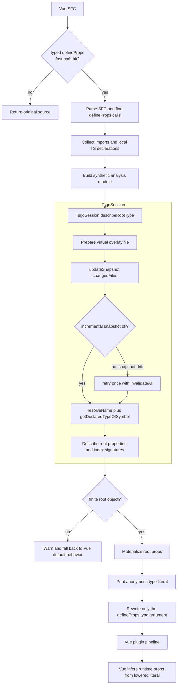

# vite-plugin-vue-type-resolver

Resolve Vue `defineProps<T>()` types with `tsgo` and lower them to finite type literals before Vue's SFC compiler runs.

## Why

Vue's built-in [`resolveType.ts`](https://github.com/vuejs/core/blob/main/packages/compiler-sfc/src/script/resolveType.ts) is largely AST-driven. That works for many local and simple cases, but it loses power once the root props type depends on the real TypeScript type system: imported utility types, global ambient types, third-party declarations, intersections, mapped types, and checker-only reductions.

This plugin takes a different route:

1. ask `tsgo` for the actual root props type that TypeScript sees in the current project
2. materialize that root type into a finite anonymous type literal
3. rewrite only the `defineProps<T>()` generic argument
4. let Vue keep doing its normal runtime-props inference from the lowered literal

The plugin does not replace Vue's compiler. It feeds Vue a simpler type.

## Shipped Behavior

- resolves `defineProps<T>()` with `tsgo`
- supports local, imported, global, and third-party types visible to the current project
- rewrites only the generic type argument
- warns and leaves the source unchanged when type analysis or root-props materialization cannot complete safely
- does not generate runtime props options by itself
- does not replace Vue's full compile pipeline

## Performance Architecture

The plugin is designed so `tsgo` startup and project loading are reused instead of repeated.

- a fast path skips files that obviously do not contain typed `defineProps<T>()`
- one `TsgoSession` is shared across transforms in the same Vite lifecycle
- transform results are cached for unchanged `.vue` sources
- when upstream type files change, the plugin prefers incremental snapshot updates and only falls back to a full rebuild when needed

The goal is simple: keep the common path incremental, while still recovering cleanly when the TypeScript snapshot state drifts.

## Example

Input:

```ts
import type { Simplify } from "type-fest";

type Base = {
  title: string;
  count?: number;
};

type Props = Simplify<
  Readonly<
    Base & {
      pinned: boolean;
      meta: {
        mode: "a" | "b";
      };
    }
  >
>;

defineProps<Props>();
```

Lowered before Vue sees it:

```ts
defineProps<{
  readonly title: string;
  readonly count?: number;
  readonly pinned: boolean;
  readonly meta: {
    mode: "a" | "b";
  };
}>();
```

Vue can then run its normal runtime type inference on the rewritten literal.

## Usage

```ts
// vite.config.ts
import { defineConfig } from "vite";
import vue from "@vitejs/plugin-vue";
import { vueTypeResolver } from "vite-plugin-vue-type-resolver";

export default defineConfig({
  plugins: [vueTypeResolver(), vue()],
});
```

The plugin works on Vue SFCs that use `<script setup lang="ts">` and `defineProps<T>()`.
If your project does not keep `tsconfig.json` at the Vite root, pass `tsconfigPath` to point the resolver at the right project file.

```ts
vueTypeResolver({
  tsconfigPath: "./tsconfig.app.json",
  logSnapshotStats: true,
});
```

`logSnapshotStats` prints the session-level incremental/full-snapshot counters when the Vite lifecycle closes.

## How It Works

### 1. Synthetic analysis module

The plugin does not ask `tsgo` to analyze the `.vue` file directly. Instead it builds a small synthetic TypeScript module next to the component that contains:

- the imports from `<script>` and `<script setup>`
- supported local declarations copied from the SFC
- a synthetic alias like `type __VTR_Target_0 = <original defineProps type>`

That module gives `tsgo` a normal TypeScript file to analyze, with the same project-visible symbols the component can already use.

### 2. Checker-first root type resolution

`TsgoSession` opens the real project from `tsconfig.json`, then resolves the synthetic target alias with checker APIs such as:

- `resolveName`
- `getDeclaredTypeOfSymbol`
- `getPropertiesOfType`
- `getIndexInfosOfType`
- `typeToString`

This is the key difference from Vue's AST-only path: the resolver sees whatever the TypeScript project sees, including global ambient types and types coming from third-party packages.

### 3. Root props materialization

The `tsgo` result is not printed back verbatim. The plugin first turns the resolved root type into a finite data model:

- root properties
- optional and readonly modifiers
- primitives and literals
- arrays, tuples, unions, intersections, and function placeholders
- nested anonymous object shapes when they are safe to inline

If the root type cannot be turned into a finite object literal safely, the plugin warns and leaves the source untouched.

### 4. Minimal source rewrite

The plugin only overwrites the generic argument span inside `defineProps<T>()`. It does not reorder code, does not touch the rest of the SFC, and does not try to generate a runtime props object on its own.

## Limitations

- runtime props options are not generated directly by this plugin; Vue still does that after the rewrite.
- only `defineProps<T>()` is handled right now.
- if `tsgo` cannot analyze the type, or if the root props type cannot be made finite and safe to print, the source is left unchanged and a warning is emitted.
- Vue still performs the rest of its normal single-file-component compile pipeline.

## High-Level Architecture


